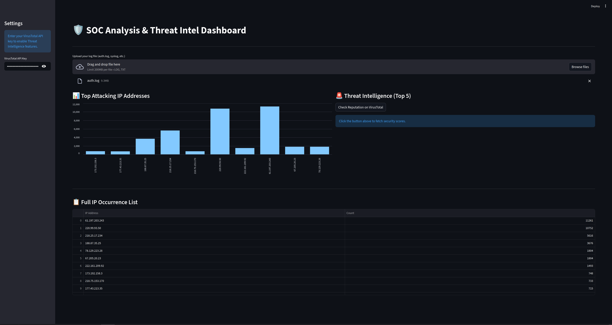

#  Analysis Report 

## 1. Introduction 
In a Security Operations Center (SOC), log analysis is a daily but time-consuming task. Raw text files like `auth.log` contain thousands of lines that are impossible to parse manually. I created this tool to automate the identification of attackers and immediately bridge the gap between "seeing an IP" and "knowing if it's dangerous."

## 2. Project Goal
The objective was to build a functional bridge between **Log Analysis** and **Threat Intelligence**.
- **Input:** Raw unstructured logs.
- **Output:** Visual frequency analysis and automated reputation scoring.

## 3. Project Workflow
1. **Data Extraction:** Developed a Regex engine to isolate IPv4 addresses.
2. **Data Processing:** Used Pandas to calculate the frequency of each IP (identifying Brute Force patterns).
3. **API Integration:** Implemented an asynchronous-style call to the VirusTotal API v3.
4. **UI Design:** Built a responsive web interface using Streamlit to present findings to stakeholders.

## 4. Results & Findings
Using a 9.3MB `auth.log` file:
- **Major Threat Identified:** IP `61.197.203.243` showed over 11,200 connection attempts.
- **Intelligence Validation:** Cross-referencing via the tool confirmed suspicious behavior, allowing for immediate blacklisting decisions.
  

## 5. Future Utility
This tool serves as a lightweight, portable investigation station. It is useful for:
- Quick triage of logs on standalone servers.
- Forensic analysis when a full SIEM (like Splunk) is not available.

---

